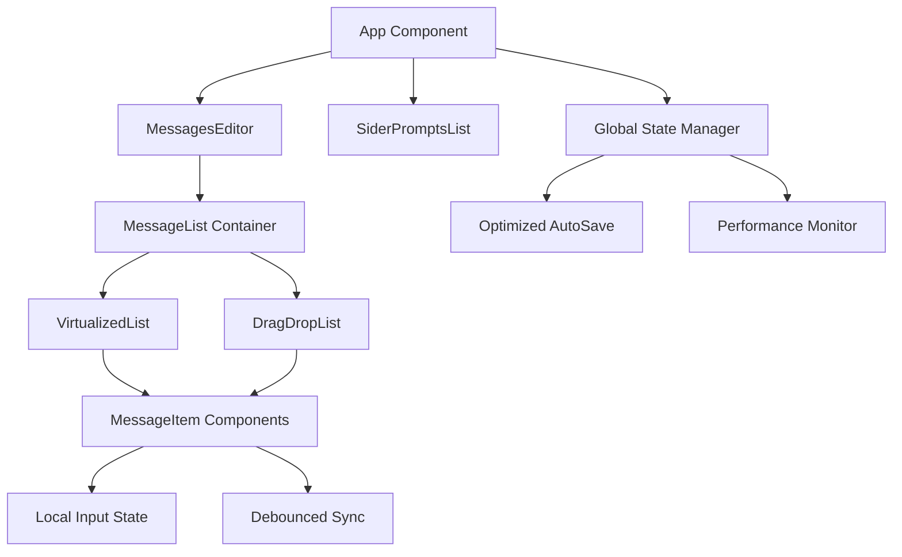

# Design Document

## Overview

This design document outlines the performance optimization strategy for the Prompt IDE application to eliminate typing lag and improve overall user experience. The current architecture uses React with Ant Design components, lazy loading for heavy libraries, and basic memoization. However, it suffers from performance issues when handling large datasets (15 prompts × 15 messages of ~1500 words each) due to excessive re-renders and inefficient state management.

The optimization strategy focuses on five key areas: component isolation, input state optimization, efficient rendering, auto-save optimization, and performance monitoring. The design maintains backward compatibility while significantly improving performance through architectural improvements.

## Architecture

### Current Architecture Analysis

The existing application follows a standard React pattern with:
- **Main App Component**: Manages global state for prompts, selected prompt, UI state
- **Memoized Components**: `SiderPromptsList`, `MessagesEditor`, `ToolsEditor`, `RunPane`
- **Lazy Loading**: Dynamic imports for `@hello-pangea/dnd` and `react-window`
- **State Management**: Direct state updates with `useDebouncedLocalStorage` for persistence
- **Styling**: CSS custom properties with theme switching support

### Proposed Architecture Improvements



## Components and Interfaces

### 1. MessageItem Component (New)

**Purpose**: Isolated, memoized component for individual message editing

**Interface**:
```typescript
interface MessageItemProps {
  message: Message;
  isCollapsed: boolean;
  isPreview: boolean;
  onUpdate: (id: string, updates: Partial<Message>) => void;
  onToggleCollapse: (id: string) => void;
  onTogglePreview: (id: string) => void;
  onRemove: (id: string) => void;
  MarkdownBlock: React.ComponentType<{content: string}>;
}
```

**Key Features**:
- Local state management for content editing
- Debounced synchronization with global state
- React.memo with custom comparison function
- Isolated re-rendering scope

### 2. Enhanced MessagesEditor Component

**Purpose**: Container component managing message list rendering strategy

**Interface**:
```typescript
interface MessagesEditorProps {
  selectedPrompt: Prompt;
  // ... existing props
  performanceMode?: 'auto' | 'virtualized' | 'standard';
  messageThreshold?: number;
}
```

**Key Features**:
- Dynamic rendering strategy selection
- Virtualization integration with drag-and-drop
- Performance threshold management
- Optimized item size calculations

### 3. LocalInputState Hook (New)

**Purpose**: Manages local input state with debounced global synchronization

**Interface**:
```typescript
interface UseLocalInputStateOptions {
  initialValue: string;
  onSync: (value: string) => void;
  debounceMs?: number;
  syncOnBlur?: boolean;
}

function useLocalInputState(options: UseLocalInputStateOptions): {
  localValue: string;
  setLocalValue: (value: string) => void;
  syncNow: () => void;
  isDirty: boolean;
}
```

### 4. Enhanced AutoSave System

**Purpose**: Optimized persistence with minimal UI blocking

**Interface**:
```typescript
interface AutoSaveOptions {
  key: string;
  data: any;
  debounceMs: number;
  compressionThreshold?: number;
  backgroundSync?: boolean;
}
```

## Data Models

### Message State Management

```typescript
// Global Message State
interface Message {
  id: string;
  role: 'system' | 'user' | 'assistant' | 'comment';
  content: string;
  label?: string;
  enabled: boolean;
}

// Local Message State (within MessageItem)
interface LocalMessageState {
  draftContent: string;
  lastSyncedContent: string;
  isDirty: boolean;
  syncTimer?: NodeJS.Timeout;
}

// Performance Metrics
interface PerformanceMetrics {
  renderCount: number;
  lastRenderTime: number;
  averageRenderTime: number;
  inputLatency: number;
}
```

### Virtualization Configuration

```typescript
interface VirtualizationConfig {
  enabled: boolean;
  itemHeight: number;
  overscan: number;
  threshold: {
    messageCount: number;
    totalContentLength: number;
  };
}
```

## Error Handling

### Input State Synchronization Errors

**Strategy**: Graceful degradation with user notification
- **Detection**: Monitor sync failures and timeout scenarios
- **Recovery**: Fallback to immediate global state updates
- **User Feedback**: Non-intrusive notifications for sync issues

### Virtualization Fallback

**Strategy**: Automatic fallback to standard rendering
- **Detection**: Monitor virtualization library loading failures
- **Recovery**: Seamless switch to non-virtualized rendering
- **Performance**: Maintain functionality with reduced optimization

### Auto-save Failures

**Strategy**: Multiple persistence strategies
- **Primary**: localStorage with compression
- **Fallback**: Session storage for temporary persistence
- **Recovery**: Manual save triggers and export functionality

## Testing Strategy

### Performance Testing

**Metrics to Monitor**:
- Input latency (target: <16ms per keystroke)
- Render time (target: <100ms for full re-render)
- Memory usage (target: stable with large datasets)
- Bundle size impact (target: <5% increase)

**Test Scenarios**:
1. **Large Dataset**: 15 prompts × 15 messages × 1500 words
2. **Rapid Typing**: Continuous input for 30+ seconds
3. **Concurrent Operations**: Typing while scrolling/reordering
4. **Memory Stress**: Extended usage sessions (1+ hours)

### Unit Testing

**Component Tests**:
- MessageItem isolation and memoization
- LocalInputState hook behavior
- AutoSave debouncing and compression
- Virtualization threshold logic

**Integration Tests**:
- End-to-end typing performance
- Data consistency across state layers
- Theme switching with optimizations
- Mobile responsiveness

### Performance Benchmarks

**Before/After Comparisons**:
- Typing latency measurements
- Component render counts
- Memory allocation patterns
- Bundle size analysis

## Implementation Phases

### Phase 1: Component Isolation (Week 1)
- Extract MessageItem component
- Implement React.memo with custom comparison
- Add local state management for content
- Verify isolation effectiveness

### Phase 2: Input Optimization (Week 1-2)
- Implement useLocalInputState hook
- Add debounced synchronization
- Integrate with MessageItem component
- Performance testing and tuning

### Phase 3: Rendering Optimization (Week 2-3)
- Enhance virtualization integration
- Implement dynamic rendering strategy
- Optimize drag-and-drop with virtualization
- Mobile performance optimization

### Phase 4: Auto-save Enhancement (Week 3)
- Implement optimized auto-save system
- Add compression for large datasets
- Background synchronization
- Error handling and recovery

### Phase 5: Performance Monitoring (Week 4)
- Add performance metrics collection
- Implement monitoring dashboard
- Optimization fine-tuning
- Documentation and testing

## Performance Optimizations

### Memoization Strategy

**Component Level**:
- MessageItem: Memo with deep content comparison
- MessageList: Memo with message array comparison
- ToolsEditor: Memo with tools array comparison

**Computation Level**:
- Item size calculations cached by content hash
- Markdown rendering memoized by content
- Theme calculations cached by theme state

### Bundle Optimization

**Code Splitting**:
- Lazy load heavy libraries only when needed
- Dynamic imports for performance monitoring tools
- Conditional loading based on dataset size

**Tree Shaking**:
- Optimize Ant Design imports
- Remove unused utility functions
- Minimize CSS bundle size

### Memory Management

**State Cleanup**:
- Clear local state timers on unmount
- Garbage collect unused message references
- Optimize virtualization buffer management

**Event Handling**:
- Debounced event handlers
- Passive event listeners where appropriate
- Efficient scroll handling for virtualization

## Browser Compatibility

**Target Browsers**:
- Chrome 90+ (primary target)
- Firefox 88+ (secondary)
- Safari 14+ (secondary)
- Edge 90+ (secondary)

**Performance Considerations**:
- Virtualization performance varies by browser
- Memory management differences
- CSS custom properties support
- JavaScript engine optimizations

## Security Considerations

**Data Persistence**:
- Validate localStorage data integrity
- Sanitize content before persistence
- Implement data migration strategies

**Performance Monitoring**:
- Avoid sensitive data in performance metrics
- Client-side only performance tracking
- No external analytics dependencies